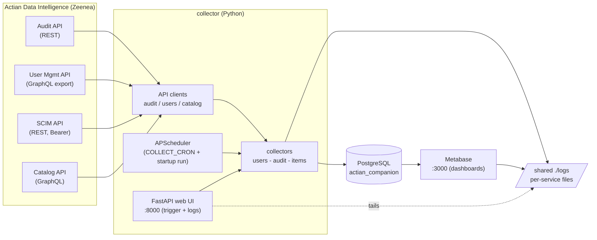
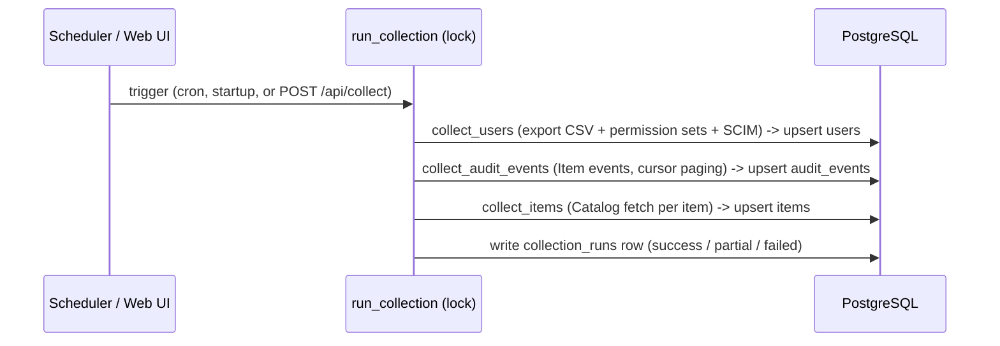
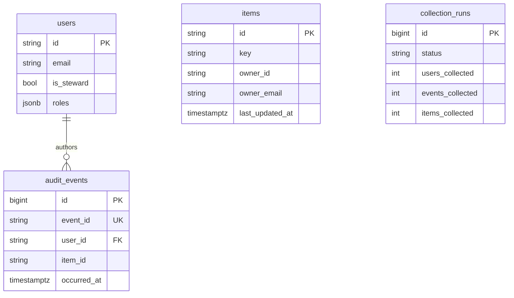
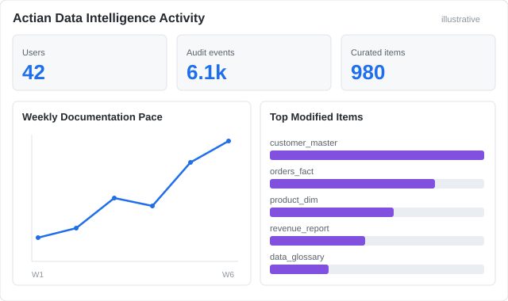
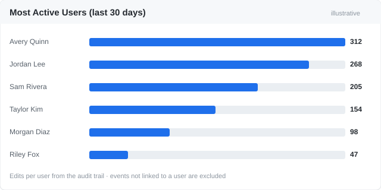
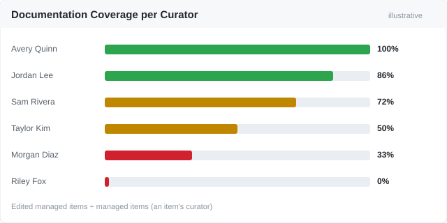

# Actian Data Intelligence Companion

A Dockerised analytics companion for the Actian Data Intelligence Platform
(Zeenea SaaS Data Catalog). A Python collector pulls data from the Actian Audit,
Catalog, User Management and SCIM APIs into PostgreSQL on a schedule, and
Metabase exposes it for self-service reporting.

The stack runs as four Docker Compose services: the companion database (`db`),
the `collector`, `metabase`, and Metabase's own application database
(`metabase-db`). The collector also serves a small web UI (port 8000) to trigger
a collection on demand.

---

## ⚠️ Disclaimer

This software is provided **"as is", without warranty of any kind**, express or
implied, including but not limited to the warranties of merchantability, fitness
for a particular purpose, and non-infringement. Use it at your own risk.

It is **not an official Actian product** and is **not affiliated with, endorsed
by, or supported by Actian**. Its sole purpose is to **illustrate what can be
built** on top of the Actian Data Intelligence Platform APIs — a demonstration,
not a production-ready or maintained tool. **No support is provided**, and the
authors accept no liability for any use of this code or its outputs.

---

## Architecture

### Components



### Collection cycle



### Data model



---

## 1. Prerequisites

- **Docker** (Engine 24+)
- **Docker Compose v2** (`docker compose ...`)
- A valid **Actian/Zeenea instance URL** and **API key** with read access to the
  Audit, Catalog, User Management and SCIM APIs.
- Python 3.12 on the host **only** to run `scripts/setup_metabase.py` (optional;
  everything else runs in containers).

---

## 2. Quick start

```bash
# 1. Configure
cp .env.example .env
#    Edit .env and set the four REQUIRED values:
#      ACTIAN_INSTANCE_URL, ACTIAN_API_KEY, POSTGRES_PASSWORD, METABASE_DB_PASSWORD

# 2. Prepare the shared log directory (all services write their logs here;
#    open perms let the Postgres/Metabase container users write to it)
mkdir -p logs && chmod 777 logs

# 3. Start the stack
docker compose up -d

# 4. Wait for startup
#    Postgres + collector come up in seconds; Metabase takes 1-2 minutes on first
#    boot. Watch readiness:
docker compose ps
docker compose logs -f collector   # Ctrl-C to stop following

# 5. Configure Metabase (database connection, saved questions, dashboards)
#    The script needs two libraries on the host:
pip install httpx python-dotenv
python scripts/setup_metabase.py
```

On startup the collector creates the database schema from the ORM models (1.0 —
no migrations), then performs **one immediate collection** (so the database is
not empty), and thereafter runs on `COLLECT_CRON`.

---

## 3. Configuration reference

All variables are read from `.env`. The four marked **required** have no default.

| Variable | Description | Default |
|---|---|---|
| `ACTIAN_INSTANCE_URL` | Full base URL of the Actian instance, no trailing slash | **required** |
| `ACTIAN_API_KEY` | API key sent as `X-API-SECRET` to Audit/Catalog/User-Mgmt (Bearer for SCIM) | **required** |
| `COLLECT_CRON` | Cron expression for collection frequency | `0 0 * * *` (daily, midnight) |
| `AUDIT_INITIAL_DAYS` | Days of history to request when retrieving audit events (Audit API `from` window) | `365` |
| `POSTGRES_HOST` | Companion PostgreSQL host | `db` |
| `POSTGRES_PORT` | Companion PostgreSQL port | `5432` |
| `POSTGRES_DB` | Companion database name | `actian_companion` |
| `POSTGRES_USER` | Companion database user | `actian` |
| `POSTGRES_PASSWORD` | Companion database password | **required** |
| `METABASE_DB_PASSWORD` | Password for Metabase's own application database | **required** |
| `LOG_LEVEL` | Collector log level (`DEBUG`/`INFO`/`WARNING`/`ERROR`) | `INFO` |
| `WEBUI_HOST` | Bind address for the trigger web UI | `0.0.0.0` |
| `WEBUI_PORT` | Port for the trigger web UI (also mapped in compose) | `8000` |
| `LOG_DIR` | In-container shared log directory (bind-mounted to `./logs`) | `/var/log/actian` |
| `LOG_MAX_BYTES` | Collector log rotation size | `5000000` |
| `LOG_BACKUP_COUNT` | Rotated collector logs to keep | `5` |
| `POSTGRES_LOG_MIN_MESSAGES` | Postgres log verbosity (db / metabase-db) | `warning` |

Used only by `scripts/setup_metabase.py` (all optional, with defaults):

| Variable | Description | Default |
|---|---|---|
| `METABASE_URL` | Base URL the setup script targets | `http://localhost:3000` |
| `METABASE_ADMIN_EMAIL` | Admin account created/used by the script | `admin@actian-companion.local` |
| `METABASE_ADMIN_PASSWORD` | Admin password (use a strong value) | `Actian-Companion-2026` |
| `METABASE_SITE_NAME` | Metabase site name | `Actian Data Intelligence Companion` |

---

## 4. Accessing Metabase

Open <http://localhost:3000>.

`scripts/setup_metabase.py` provisions Metabase end to end and is **idempotent**
(safe to re-run): it completes the setup wizard on first run, logs in on later
runs, **removes Metabase's default example assets** (Sample Database, the
*E-commerce Insights* dashboard and the *Examples* collection), connects the
`actian_companion` database, and (re)builds the application cards and dashboards.

> All audit-based statistics **exclude events not linked to a user** (rows with
> no `user_id`); only known users are counted.

Default admin login (override via `.env` — see §3):

- email `admin@actian-companion.local`
- password `Actian-Companion-2026`

> Change `METABASE_ADMIN_PASSWORD` in `.env` before running in any shared
> environment.

The script creates **five example dashboards** for users to build on:

**Actian Data Intelligence Activity** (audit-event activity)
- Top Contributors (last 30 days), Top Modified Items (last 30 days), Weekly
  Documentation Pace, Events by Action, Daily Activity (last 30 days).

**Users & Stewardship** (user population)
- Stewards vs Non-stewards, Users by Permission Set, Most Active Users (by login
  count).

**Most Active Users** (activity from audit events)
- Most / Least active users for each rolling window — last 7 days, 30 days,
  365 days (top-10 each; least-active ranks users with ≥1 event) — plus an
  *All Users — Activity Summary* table (every user, all-time event count).

**Most Updated Items** (audit events)
- Top-10 items by number of modifications, plus a detail table (type, count,
  last modified).

**Documentation Coverage per Curator**
- Per curator, a coverage ratio = *managed items the curator has edited* ÷
  *items the curator manages* (managed = the item's curator). Bar + detail table
  (managed / edited / ratio).

### Example dashboards

> The images below are **illustrative mock-ups with synthetic, anonymized data**
> (not real catalog content) — your dashboards render live data from your
> instance.

<p>
  
</p>
<p>
  
  
</p>

Re-run any time after a fresh collection to refresh:

```bash
python scripts/setup_metabase.py
```

---

## 5. Checking collector logs

```bash
docker compose logs -f collector
```

Each cycle logs the run status and per-collector counts, e.g.
`Collection run success: users=42 events=120 items=0`. Every run is also
recorded as a row in the `collection_runs` table (`status` =
`success` / `partial` / `failed`, plus counts and any error message).

---

## 6. Triggering a manual collection run

### Web UI (recommended)

The collector serves a small web UI at <http://localhost:8000>:

- A **“Run collection now”** button triggers a full cycle on demand, bypassing
  the cron schedule.
- A table shows recent runs (status + per-collector counts), auto-refreshing.
- The trigger shares a lock with the scheduler, so manual and cron runs never
  overlap (a second trigger while one is running returns *already running*).

- A **per-service log viewer**: pick a service (collector, db, metabase,
  metabase-db) and tail the last N lines of its log on demand (optional
  auto-refresh).

```
POST http://localhost:8000/api/collect    # 202 started, or 409 if already running
GET  http://localhost:8000/api/runs        # recent collection_runs as JSON
GET  http://localhost:8000/api/logs/services        # services with a log file
GET  http://localhost:8000/api/logs/{service}?lines=200   # tail a service log
```

Each service writes its log into the shared `./logs` directory (bind-mounted
into every container); the collector tails those files. Verbosity is `LOG_LEVEL`
(collector + Metabase) / `POSTGRES_LOG_MIN_MESSAGES` (databases); the collector
log rotates by size (`LOG_MAX_BYTES` × `LOG_BACKUP_COUNT`), the Postgres logs
truncate daily.

### Alternatives

Restart the collector — it runs one immediate collection on every start:

```bash
docker compose restart collector
```

Verify a run landed:

```bash
docker compose exec db psql -U actian -d actian_companion \
  -c "SELECT started_at, status, users_collected, events_collected FROM collection_runs ORDER BY id DESC LIMIT 5;"
```

---

## 7. Known limitations and scope

- **Items enrichment is active.** Each cycle enriches the `items` table from the
  Catalog API for every distinct item seen in the audit trail — id, key, name,
  type, description (+ description type `RAW`/`HTML`), owner (id/name/email from
  the item's *curators*), and the catalog last-updated time. Strategy is
  incremental + refresh-stale (re-fetch after `REFRESH_STALE_DAYS`, default 7).
  - Items **deleted** from the catalog cannot be enriched (`ITEM_NOT_FOUND`) and
    are skipped; they are re-checked on subsequent runs.
  - Owner is the catalog *curator* (a contact). Items with no curator have null
    owner fields.
- **Audit scope:** only `eventType = Item` events are collected (they drive all
  three Metabase questions). User/Group/ApiKey/PermissionSet audit events are
  not stored.
- **Steward detection** uses the User Management export `License type ==
  "Steward"` (see `DISCOVERY.md`), not a SCIM group name.
- **Per-API auth differs:** Audit, Catalog and User Management use the
  `X-API-SECRET` header; **SCIM uses `Authorization: Bearer`**. This is by
  design, confirmed during API discovery.
- **API contracts** (endpoints, pagination, field mappings) are documented in
  `DISCOVERY.md`, the source of truth for the client implementations.
